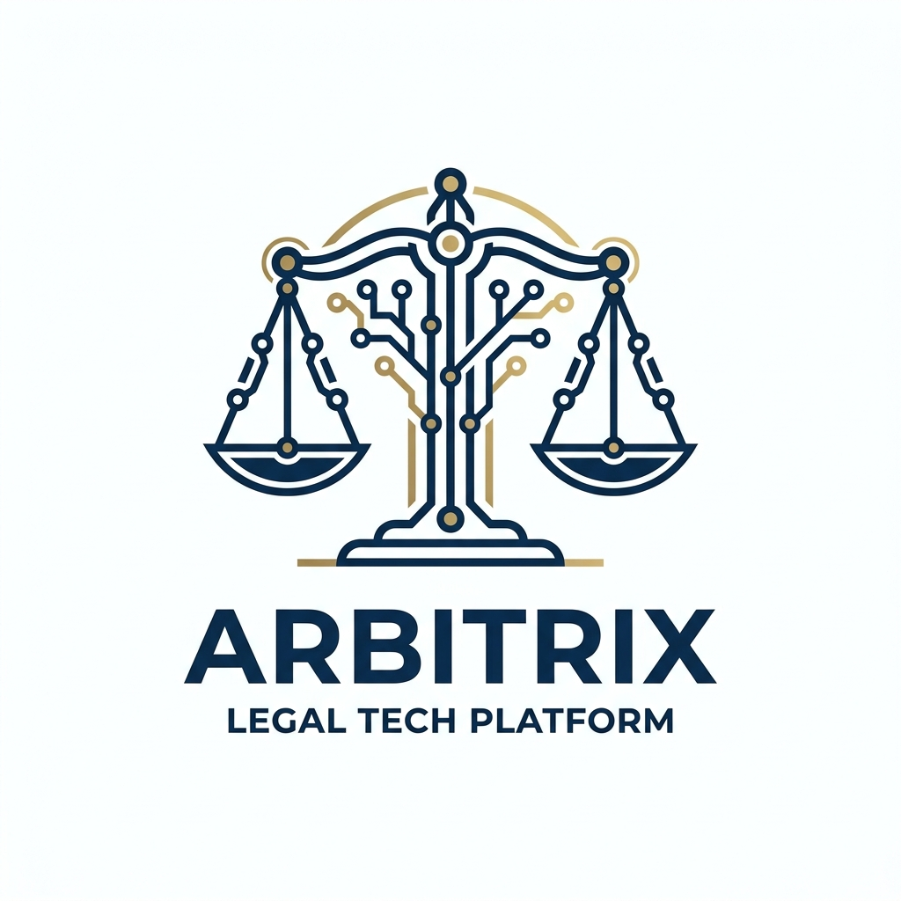

<div align="center">

# ⚖️ Arbitrix
### *Three Minds. One Verdict.*

**AI-powered legal contract analysis platform built natively for Pakistani law**


</div>

---

## Demo

<div align="center">
  
</div>

*Three-agent debate analyzing a Pakistani employment contract*

---

## What Is Arbitrix

Arbitrix is a multi-agent AI legal consulting platform that analyzes contracts through three expert AI personas simultaneously — a Lawyer, a Businessman, and a Regulator — who debate every clause in real time before delivering a structured verdict.

Most Pakistanis — SME owners, freelancers, and startup founders — sign contracts they don't fully understand, with no affordable access to legal review. Arbitrix solves this by providing instant, professional-grade contract analysis grounded in Pakistani law: Contract Act 1872, Companies Act 2017, SECP regulations, and SBP guidelines.

Unlike generic AI tools trained on Western legal templates, Arbitrix is built natively for Pakistani law, delivers output in both English and Urdu, and uses a calibrated scoring system that prevents false alarms on fair contracts.

---

## How It Works

```
Upload Contract (PDF/DOCX)
        ↓
Text Extraction (PyMuPDF / python-docx)
        ↓
RAG Retrieval — 3 parallel queries → Neon DB pgvector
(4,289 chunks from Pakistani legal documents)
        ↓
Three Agents fire simultaneously (asyncio.gather):
  ⚖️  Lawyer      → Pakistani Contract Act 1872
  💼  Businessman → Commercial risk analysis
  🏛️  Regulator   → SECP / SBP compliance
        ↓
SSE Streaming → Live debate on screen
        ↓
Synthesis Agent → Risk Score + Red Flags + Recommendations
        ↓
Mistral Translation → Urdu output (if selected)
        ↓
Session Cache → Instant language switching (zero extra API calls)
```

---

## Key Features

- **Multi-agent parallel analysis** via `asyncio.gather()` — three experts run concurrently, not sequentially
- **Live SSE streaming debate** — token by token, each agent column populates in real time
- **RAG system** with 4,289 Pakistani legal document chunks — agents cite actual law, not guesses
- **Law citation enforcement** — every finding must cite a specific Pakistani act, section, or regulation
- **Risk score 1–10** with calibrated scoring guide — prevents hallucinated high scores on fair contracts
- **Score validation layer** — post-synthesis check caps scores based on actual finding counts
- **Bilingual output** — English + Urdu with RTL rendering and Noto Nastaliq font
- **Session-only caching** — both language versions generated in one call; language switch = zero API calls
- **Pakistani law native** — Contract Act 1872, SECP, SBP, EOBI, ESSI, PTA
- **Technical and Plain language modes** — formal legal analysis or simple everyday explanations
- **Graceful fallback** — agents run with base prompts even if RAG or Neon DB is unreachable
- **Retry with exponential backoff** — respects Gemini's `retryDelay` on 429 rate limit errors

---

## Tech Stack

| Layer | Technology | Purpose |
|---|---|---|
| Frontend | Next.js 16 + Tailwind CSS v4 | Upload UI, debate panel, verdict card |
| Backend | FastAPI (Python 3.13, async) | REST endpoints, SSE streaming, orchestration |
| Primary LLM | Gemini 2.5 Flash (`google-genai`) | Three agents + synthesis (temp=0.3) |
| Translation | Mistral Codestral (`mistralai`) | English → Urdu translation (temp=0.1) |
| Embeddings | `sentence-transformers` all-MiniLM-L6-v2 | 384-dim vectors for RAG |
| Vector DB | Neon DB + pgvector | HNSW index, cosine similarity search |
| PDF Parsing | PyMuPDF (`fitz`) | Text extraction from contracts |
| DOCX Parsing | `python-docx` | Word document extraction |
| Streaming | Server-Sent Events (`sse-starlette`) | Real-time token streaming to frontend |
| Orchestration | `asyncio.gather()` | Parallel agent execution |
| Package Manager | `uv` | Python dependency management |
| Deployment | Vercel (frontend) + Render (backend) | Production hosting |

---

## Project Structure

```
arbitrix/
├── README.md
├── .gitignore
│
├── backend/
│   ├── main.py                          # FastAPI app, endpoints, CORS, lifespan
│   ├── config.py                        # Typed settings via pydantic-settings
│   ├── setup_db.sql                     # Neon DB schema — run once on Neon dashboard
│   ├── pyproject.toml                   # Python dependencies (managed by uv)
│   ├── uv.lock
│   ├── .env                             # API keys and connection strings
│   ├── .python-version                  # Pins Python 3.13
│   │
│   ├── agents/                          # System prompt definitions
│   │   ├── __init__.py
│   │   ├── lawyer.py                    # Cites Contract Act 1872, Companies Act 2017
│   │   ├── businessman.py               # Cites labour law, commercial regulations
│   │   ├── regulator.py                 # Cites SECP, SBP, EOBI, ESSI, PTA
│   │   └── synthesis.py                 # Calibrated scoring guide + honest assessment rules
│   │
│   ├── services/
│   │   ├── __init__.py
│   │   ├── orchestrator.py              # RAG → agents → synthesis → validation → translation
│   │   └── pdf_extractor.py             # PyMuPDF text extraction
│   │
│   ├── models/
│   │   ├── __init__.py
│   │   └── schemas.py                   # Pydantic request/response models
│   │
│   ├── rag/
│   │   ├── __init__.py
│   │   ├── db.py                        # asyncpg pool, pgvector codec, schema auto-creation
│   │   ├── embedder.py                  # Singleton sentence-transformers wrapper
│   │   ├── ingester.py                  # PDF/DOCX reader, sentence chunker, batch insert
│   │   └── retriever.py                 # Cosine similarity search, pool + standalone fallback
│   │
│   ├── scripts/
│   │   ├── __init__.py
│   │   └── ingest_docs.py               # CLI: uv run python scripts/ingest_docs.py ./legal_docs
│   │
│   └── legal_docs/                      # Pakistani legal documents for RAG ingestion
│       ├── core_law/
│       │   ├── Contract_Act_1872.doc.pdf
│       │   ├── companiesAct2017.pdf
│       │   └── the_arbitration_act-_1940-pdf.pdf
│       ├── secp/
│       │   └── Companies-Regulations-2024-updated-upto-25.07.2025-Reviewed-14042026.pdf
│       ├── sbp/
│       │   └── EFT_Act_2007.pdf
│       └── sample_contracts/            # (add sample contracts here)
│
└── frontend/
    ├── package.json
    ├── next.config.ts
    ├── tsconfig.json
    ├── postcss.config.mjs
    ├── eslint.config.mjs
    ├── .env                             # NEXT_PUBLIC_API_URL
    │
    ├── public/
    │   ├── favicon.png
    │   └── placeholder.svg
    │
    └── src/
        ├── index.css                    # Global styles, Tailwind v4, custom tokens
        │
        ├── app/
        │   ├── layout.tsx               # Root layout, Noto Nastaliq font, Navbar
        │   ├── page.tsx                 # Landing page (Hero, KnowledgeSection, TrustSection)
        │   ├── not-found.tsx
        │   ├── analyze/
        │   │   ├── page.tsx
        │   │   └── AnalyzeClient.tsx    # Mode selector + contract type + upload
        │   ├── debate/
        │   │   ├── page.tsx
        │   │   └── DebateClient.tsx     # SSE consumer, three-column live stream
        │   ├── verdict/
        │   │   ├── page.tsx
        │   │   └── VerdictClient.tsx    # Risk score, red flags, summaries, debate replay
        │   └── features/
        │       └── page.tsx
        │
        ├── components/
        │   ├── NavLink.tsx
        │   ├── Providers.tsx            # React Query + theme providers
        │   ├── arbitrix/                # Domain-specific components
        │   │   ├── Navbar.tsx           # Language toggle (EN / اردو)
        │   │   ├── Hero.tsx
        │   │   ├── HowItWorks.tsx
        │   │   ├── KnowledgeSection.tsx
        │   │   ├── TrustSection.tsx
        │   │   ├── ContractTypeSelector.tsx
        │   │   ├── UploadZone.tsx       # Drag-drop upload, calls POST /upload
        │   │   ├── LiveDebate.tsx       # Animated debate replay with real findings
        │   │   ├── Verdict.tsx
        │   │   └── DisclaimerStrip.tsx
        │   └── ui/                      # shadcn/ui primitives (40+ components)
        │       ├── button.tsx
        │       ├── card.tsx
        │       ├── dialog.tsx
        │       ├── sheet.tsx
        │       ├── toast.tsx
        │       └── ...
        │
        ├── contexts/
        │   └── AppContext.tsx           # Global state + sessionStorage bilingual cache
        │
        ├── hooks/
        │   ├── use-mobile.tsx
        │   └── use-toast.ts
        │
        └── lib/
            ├── i18n.ts                  # EN / UR translation strings
            └── utils.ts                 # Tailwind class merge helper
```

---

## Prerequisites

- Python 3.13+
- Node.js 18+
- [`uv`](https://docs.astral.sh/uv/getting-started/installation/) — Python package manager
- Gemini API key — [aistudio.google.com](https://aistudio.google.com) (use `gemini-2.5-flash`)
- Mistral API key — [console.mistral.ai](https://console.mistral.ai) (free tier, no card required)
- Neon DB account — [neon.tech](https://neon.tech) (free tier works)

---

## Environment Variables

| Variable | Service | Where To Get |
|---|---|---|
| `GEMINI_API_KEY` | Google AI Studio | [aistudio.google.com](https://aistudio.google.com) |
| `GEMINI_MODEL` | — | Default: `gemini-2.5-flash` |
| `MISTRAL_API_KEY` | Mistral AI | [console.mistral.ai](https://console.mistral.ai) |
| `MISTRAL_MODEL` | — | Default: `codestral-latest` |
| `NEON_DATABASE_URL` | Neon DB | Neon dashboard → Connection string |
| `CORS_ORIGIN` | — | Default: `http://localhost:3000` |
| `NEXT_PUBLIC_API_URL` | — | Default: `http://localhost:8000` |

---

## Running the Backend

```bash
# 1. Navigate to backend
cd backend

# 2. Install dependencies
uv sync

# 3. Create .env file
cp .env.example .env
# Fill in GEMINI_API_KEY, GEMINI_MODEL, MISTRAL_API_KEY, MISTRAL_MODEL, NEON_DATABASE_URL
```

**4. Set up Neon DB** — run this SQL in the Neon dashboard SQL editor:

```sql
CREATE EXTENSION IF NOT EXISTS vector;

CREATE TABLE IF NOT EXISTS legal_chunks (
    id           SERIAL PRIMARY KEY,
    source_file  TEXT NOT NULL,
    chunk_index  INTEGER NOT NULL,
    content      TEXT NOT NULL,
    embedding    vector(384),
    doc_type     TEXT NOT NULL,
    created_at   TIMESTAMP DEFAULT NOW()
);

CREATE INDEX IF NOT EXISTS legal_chunks_embedding_idx
    ON legal_chunks USING hnsw (embedding vector_cosine_ops);
```

```bash
# 5. Ingest legal documents
uv run python scripts/ingest_docs.py ./legal_docs

# 6. Start the server
uv run uvicorn main:app --reload
```

Backend runs at **http://localhost:8000**

---

## Running the Frontend

```bash
# 1. Navigate to frontend
cd frontend

# 2. Install dependencies
npm install

# 3. Start dev server
npm run dev
```

Frontend runs at **http://localhost:3000**

---

## Legal Documents Included

| Document | Category | Relevance |
|---|---|---|
| Pakistani Contract Act 1872 | `core_law` | Foundation of all contract law |
| Companies Act 2017 | `core_law` | Corporate contracts and obligations |
| Arbitration Act 1940 | `core_law` | Dispute resolution clauses |
| EFT Act 2007 | `sbp` | Electronic payment terms |
| Companies Regulations 2024 (SECP) | `secp` | Corporate compliance requirements |

---

## API Endpoints

| Method | Endpoint | Body | Response |
|---|---|---|---|
| `POST` | `/upload` | `multipart/form-data` — PDF or DOCX | `{ contract_id, contract_text }` |
| `POST` | `/analyze` | `{ contract_text, mode, language }` | SSE stream of agent events |
| `POST` | `/verdict` | `{ lawyer, businessman, regulator }` | Synthesized verdict JSON |

### SSE Event Shape

```json
// Streaming chunk (during analysis)
{ "agent": "lawyer", "chunk": "token text", "done": false }

// Agent complete
{ "agent": "lawyer", "chunk": "", "done": true }

// Final synthesis event — both language versions in one response
{
  "agent": "synthesis",
  "chunk": "",
  "done": true,
  "verdict": {
    "english": {
      "risk_score": 2.1,
      "red_flags": [{ "clause": "...", "risk": "...", "severity": "HIGH", "agent": "lawyer" }],
      "recommendations": ["..."],
      "summary_english": "..."
    },
    "urdu": {
      "risk_score": 2.1,
      "red_flags": [{ "clause": "...", "risk": "...", "severity": "HIGH", "agent": "lawyer" }],
      "recommendations": ["..."],
      "summary_urdu": "..."
    }
  }
}
```

---

## RAG Architecture

The RAG pipeline retrieves relevant Pakistani legal precedents before each analysis run:

- Documents are chunked by sentence boundaries (3–5 sentences per chunk, 1-sentence overlap)
- Each chunk is embedded using `sentence-transformers/all-MiniLM-L6-v2` (384 dimensions, runs locally)
- Embeddings stored in Neon DB with an HNSW index for fast cosine similarity search
- Three parallel retrieval queries fire before agents start — one per agent with a domain-specific query
- Top 5 most relevant chunks (similarity ≥ 0.3) are injected into each agent's system prompt
- If Neon DB is unreachable, agents run with base prompts — the app never crashes due to RAG failure

---

## Risk Score Calibration

| Score | Meaning |
|---|---|
| 9–10 | Multiple HIGH findings across agents — **Do not sign** |
| 7–8 | At least one HIGH finding — **Major revision needed** |
| 5–6 | Several MEDIUM findings — **Review carefully** |
| 3–4 | Only LOW findings — **Small improvements needed** |
| 1–2 | No genuine findings — **Fair contract, safe to sign** |

A post-synthesis validation layer enforces these bounds — if agents return empty findings, the score is capped at 1.5 regardless of what the synthesis agent outputs.

---

## Team

| Role | Name | Responsibilities |
|---|---|---|
| Backend Engineer | Abdullah | FastAPI, RAG pipeline, agent orchestration, SSE streaming, scoring calibration |
| Frontend Engineer | Sharina Khan | Next.js UI, SSE consumer, verdict card, bilingual cache, Urdu rendering |
| Organization | Archonera | — |

---

## License

MIT License — see [LICENSE](LICENSE) for details.

---

*Arbitrix is an AI-powered tool for informational purposes only. It is not a substitute for qualified legal counsel. Always consult a licensed lawyer before signing high-value contracts. Arbitrix flags risk for your awareness — final decisions remain yours.*
